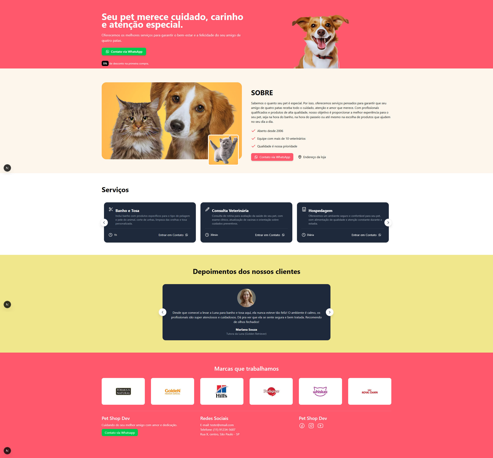

# 🐾 Landing Page - Serviços Pet com Next.js

Landing page moderna e otimizada para serviços pet (banho, tosa e cuidados), desenvolvida com [Next.js](https://nextjs.org/). Foco em SEO, performance e responsividade.

## 📸 Preview



---

## 🚀 Tecnologias Utilizadas

- [Next.js](https://nextjs.org/)
- React
- HTML5 / CSS3
- Tailwind
- SEO com `next/head`
- Open Graph / Twitter Cards
- Schema.org (JSON-LD para SEO local)

---

## 🧩 Funcionalidades

- Página única com foco em conversão
- Tags meta dinâmicas para SEO
- Estrutura semântica otimizada (H1, H2…)
- Layout responsivo para dispositivos móveis
- Open Graph para compartilhamento social

---

## 📦 Instalação

```bash
# Clone o repositório
git clone https://github.com/seu-usuario/nome-do-repo.git

# Acesse a pasta do projeto
cd nome-do-repo

# Instale as dependências
npm install
# ou
yarn install

# Ambiente de desenvolvimento
npm run dev

🌐 Deploy
Recomendado: Vercel
Pronto para deploy com apenas um clique.
